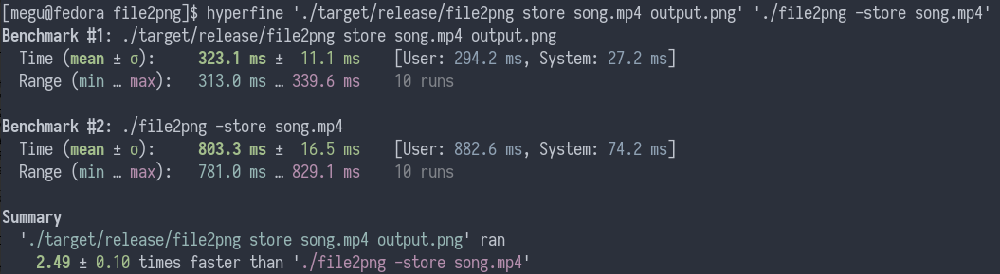
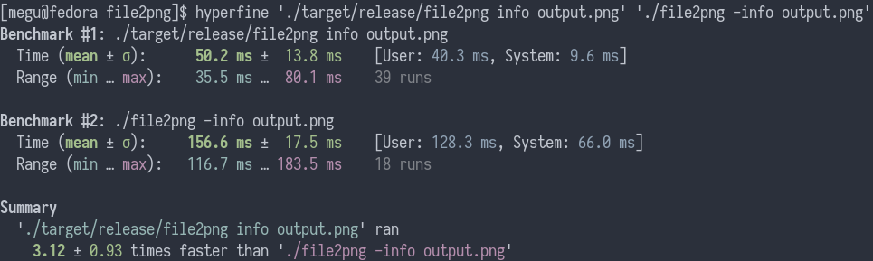
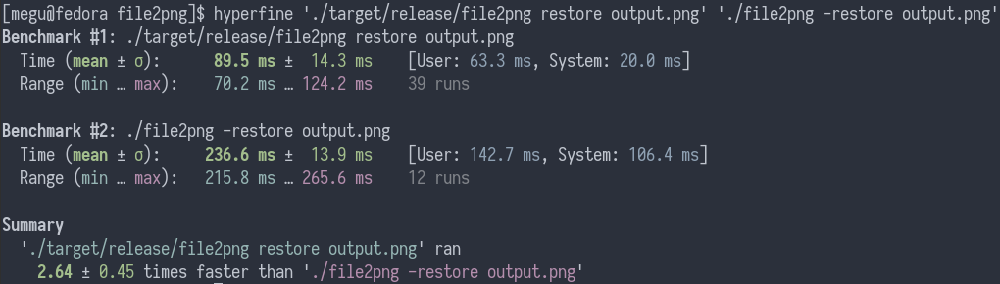

# file2png

## file2png is a rewrite of the bash script with the same name.
## The original script was at [this link](https://github.com/rekcuFniarB/File2PNG).

## Why a rewrite?
The bash scripts requires coreutils and Imagemagick. This are common on a *UNIX system, 
but not very common on Windows. This rewrite was built with cross-platform libraries so
it should work on every system where you can find Rust.

I tried to keep the dependencies as low as possible, that's why I used argh and regress 
instead of the more popular clap and regex crates.

## Installing file2png
To install file2png, you can use `cargo install file2png` or build it from source.

To build from source, first
```sh
git clone https://github.com/meguminloli/file2png
```
To build it for release,
```sh
cargo build --release
```

To debug it,
```sh
cargo build
```

On my system, the build (with all the dependencies) takes less than 12 seconds in release.

For smaller binaries and maybe improved performance, check out [min-sized-rust](https://github.com/johnthagen/min-sized-rust).

## Usage
To store a file as a png:
```sh
file2png store <input> <output>
```
To append comments to resulting metadata:
```sh
file2png store <input> <output> --comments <comment> --comments <comment> ..
```

To restore a png:
```sh
file2png restore <input>
```
This will restore the png to the original file name.
To choose the resulting file name
```sh
file2png restore <input> --output <output>
```

To check the metadata
```sh
file2png info <input>
```

## Benchmarks





## Licensing
This project is licensed under GPLv3, because the original script was under the same
license.


### Have fun!
